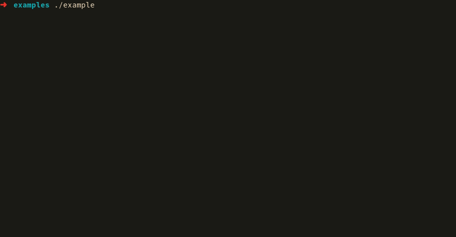

# Silent_Log

Silent_Log is a really simple library you can add to any of your C / C++ project to display some nice and pretty log messages. This includes the following type of messages : 

- log_info
- log_success
- log_error
- log_verbose
- log_progress

Silent_Log supports string formatting. It's based on ANSI colors and supports Windows.

## Usage

To use it in your code, nothing is more simple, here is an example : 

```c
#include <stdio.h>
#include <unistd.h>

// To start using it
#include "log.h"

int main(int argc, char **argv) {
        puts("");

        // Defines verbosity or not (verbose is an extern global variable)
        verbose = 1;

        log_info("This is an info message\n");
        log_success("This is a success message\n");
        log_error("This is an error message\n");
        log_verbose("This is a verbose message\n");

        int a = 1, b = 2, c = a + b;
        // Using a format string
        log_info("%d + %d = %d !\n", a, b ,c);

        double progress;
        for(int i = 0; i <= 10; i++) {
            progress = ((double)i / 10) * 100;
            log_progress("Progress : %3.2lf", progress);
            sleep(1);
        }

        puts("\n");
        return 1;
}
```

## Example

```bash
gcc -o example example.c log.c
```


## Resources

To add Windows ANSI color support, Silent_Pass relies on this great project : https://github.com/mattn/ansicolor-w32.c
